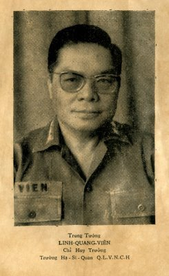

# Linh Quang Vien

First of all, I would like to briefly
introduce the Hai Ninh Province to our
readers. On the map of Vietnam, Hai Ninh
is a black dot at the easternmost SinoVietnamese border.
Comparatively small, the province of Hai Ninh has
experienced many ups and downs. Originally under the
Nguyen Dynasty, it was named “Phu” (large district) Hai
Dong. Under the French rule, it was elevated to “Dao”, small
province Hai Ninh, then “Tinh” (province) Hai Ninh.
Under the French, provinces having common borders
with China were directly under the command of French
Army officers ranking full colonel or higher, who held both
administrative and military authorities. Therefore, Hai Ninh
had another title: The First Military Territory of Hai Ninh
(Premier Territoire Militaire de Hai Ninh).
The most glorious historical period of Hai Ninh Province was from 1947 to 1954. During those 8 years, Hai Ninh
became the Nung Hai Ninh Autonomous Territory
(NHNAT) under the brilliant leadership of Colonel Vong A
Sang.
Regretfully, when Vietnam was partitioned in two
parts, the map of Vietnam was modified by the Communists.
Hai Ninh was demoted to the status of a small district, a subordinate part of Quang Ninh Province.
To the Vietnamese people and the Nung ethnic group
in particular, Hai Ninh Province has always been recognized
as a strategic strongpoint protecting the Vietnamese frontier.
Facing the political situation of 1947, the people of Hai Ninh
Province proved themselves able to provide security and
prosperity for the territory during the entire 8 years, due to
their capacity, man power and resources, while the whole
country from North to South was engulfed in the flame of
war.
Those achievements resulted from the work of the
brilliant Nung leader of the Territory, Colonel Vong A Sang;
the solid cooperation of soldiers and local residents buttressed his leaderships, but above all, from the anticommunist spirit of the tribal of people from all walks of
life.
In regard to the residents, the military and civilian
elements of the Territory were closed tied to the Nungs, a
tribe of strong anti-communist spirit. Although the tribe inhabited of three fourths of the total territory population, the
Nungs lived in harmony with other ethnic groups.
With blood and tears, they had written their dramatic
pages of history, since their immigration by waves from
South China to Hai Ninh. They had to continuously confront
oppression, threats, robberies, pillages, as well as in the later
years, when they had to work together to build the autonomous territory, without being entangled into the fratricidal
war for many years. When the 1954 Geneva Accord partitioned the country into two, a million North Vietnamese left behind the
Communist regime, determined to resettle in the South.
More than 50,000 Nung people, one third of the Territory
population (a large proportion compared to the total number
of North Vietnamese evacuees), followed their leader to the
South by their own means. Most of them then resettled at
Song Mao, Binh Thuan Province (SVN). They set up a new
district and bestowed it with the traditional name Hai Ninh.
During this trying stage, the Nung had to cope with
economic and political adversaries, while actively contributing to the prosperity of the South. Numerous achievements
have been recorded in the domains of politics, military and
administration of the First Republic (1954-1963), especially
of the Second Republic (1963-1975) of Vietnam.
Finally, in what became known as Black April, 1975,
South Vietnam was occupied. Over 3 million Southerners
had to pay an exorbitant price for their freedom. The Nungs,
with their inherent solidarity and struggling determination
once more succeeded in resettling in foreign countries, especially in the United States of America, the Los Angeles area,
in particular. The Nung community not only stabilized their
living conditions, but also had effective plans to secure the
future of their descending generations here.
Such has been my impression after having the honor
to read “The Nung Ethnic and Autonomous Territory of Hai Ninh – Vietnam” written by a group of Nungs notables who
have patiently worked for many recent months.
This was a complete research on the Nungs of Hai
Ninh, beginning with their start-up as settlers until their territorial self-governing and before their evacuation to the
South. Thereafter they were fleeing the country by boat, in
the grandest exodus in Vietnam history. Every stage of activities in each district has been recorded in a lively, truthful
style with concrete details. Therefore, we believe that the
book is a valuable and useful work for those who wish to
research the Territory history, particularly for younger generations. 

